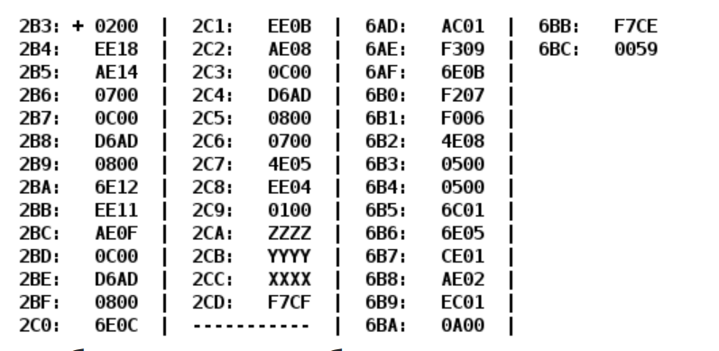

# Лабораторная работа #4

По выданному преподавателем варианту восстановить текст заданного варианта программы и подпрограммы (программного комплекса), определить предназначение и составить его описание, определить область представления и область допустимых значений исходных данных и результата, выполнить трассировку программного комплекса.

## Вариант 8532

- [Отчёт](./docs/Lab4.pdf)

